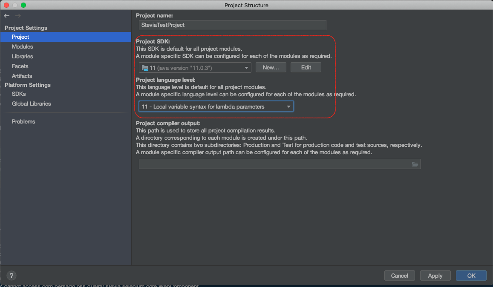
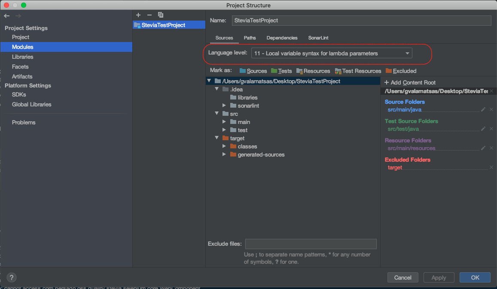
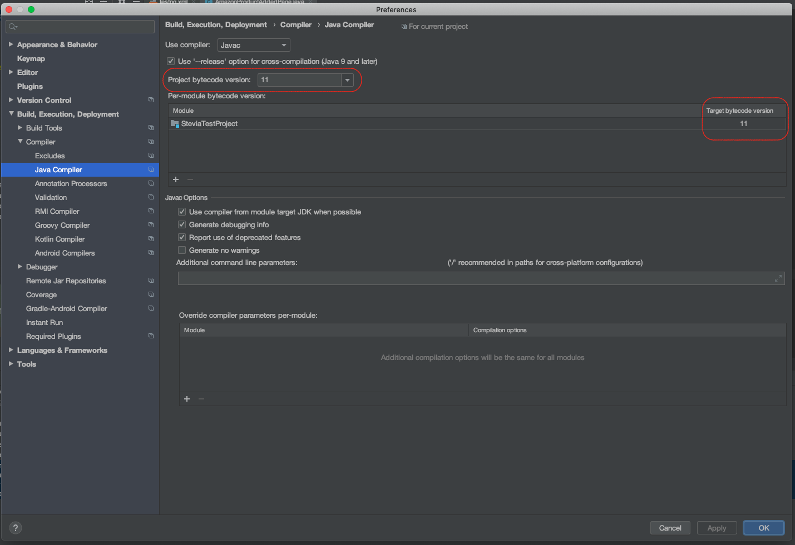
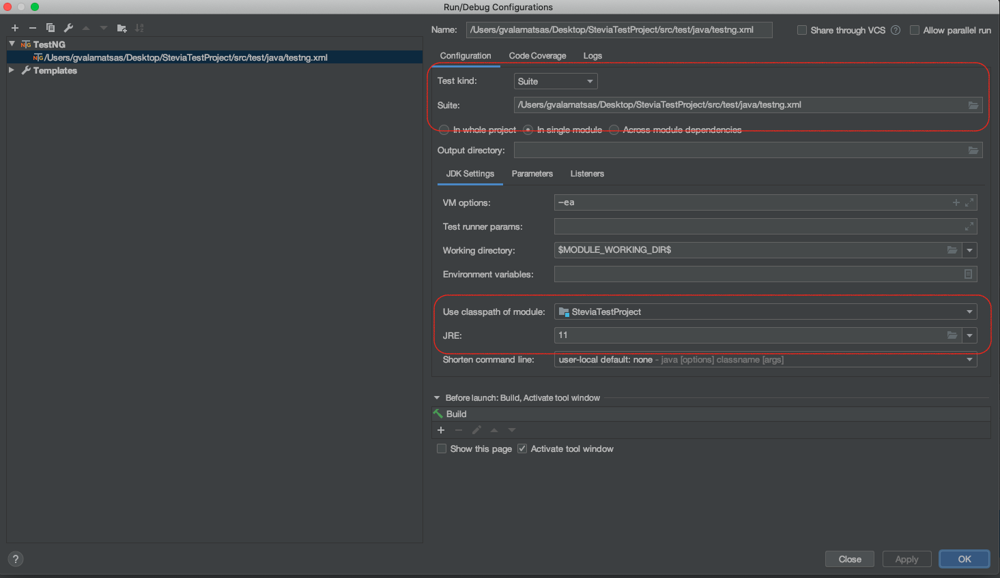

# Stevia Test Project
This is a repo to test the functionality of the testing framework [Stevia](https://github.com/persado/stevia).


To run it with IntelliJ IDEA, some configuration may be required:

Right click in project -> Open Module Settings:



IntelliJ IDEA -> Preferences -> Build, Execution, Deployment -> Compiler -> Java Compiler


Run configuration:


Also make sure you have the chromedriver installed:
```bash
$ which chromedriver
/usr/local/bin/chromedriver
```

If not, you may face this error:
```The path to the chromedriver executable must be set by the `webdriver.chrome.driver` system property error``` 
If this is the case, a `brew install --cask chromedriver` (MacOS) or `sudo apt-get install chromium-driver` (Debian Linux)
may fix this error. For more info check the [SeleniumHQ ChromeDriver documentation](https://github.com/SeleniumHQ/selenium/wiki/ChromeDriver)